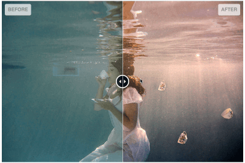

# jQuery Images Compare

A jquery plugin for comparing two images



## Features

- compatibility : ie9+

- Effort to put appearance via css (easier to skin / override)

- Touch friendly, mouse drag, with a big thanks to [Hammerjs](http://hammerjs.github.io/) :)

- Responsive

- You can listen to change event to add some of your logic

- You can change the value from external code

- Animation option when changing the value

- Optional alternative interaction modes : drag by default (the recommended one), click and mousemove (warning desktop friendly only for this settings)

> NB : This library only does horizontal slide

## Quick start

In your head section, include the css (a minified version is also provided) :

```html
<link rel="stylesheet" href="images-compare.css">
```

Include the required javascript, before the body closing tag :

```html
<script type="text/javascript" src="https://cdnjs.cloudflare.com/ajax/libs/jquery/2.2.4/jquery.min.js"></script>
<script type="text/javascript" src="https://cdnjs.cloudflare.com/ajax/libs/hammer.js/2.0.8/hammer.min.js"></script>
<script type="text/javascript" src="jquery.images-compare.min.js"></script>
```

Setup your html (minimal example) :

```html
<!-- Main div container -->
<div id="myImageCompare">
    <!-- The first div will be the front element, to prevent FOUC add a style="display: none;" -->
    <div style="display: none;">
        
    </div>
    <!-- This div will be the back element -->
    <div>
        
    </div>
</div>
```

Call the plugin :

```js
$('#myImageCompare').imagesCompare();
```

## Documentation

### Install via npm

You can get the project via npm too :

```sh
npm install jquery-images-compare
```

### Plugin settings

You can change plugin settings by passing an option object, example :

```js
$('#myImageCompare').imagesCompare({
    initVisibleRatio: 0.2,
    interactionMode: "mousemove",
    addSeparator: false,
    addDragHandle: false,
    animationDuration: 450,
    animationEasing: "linear",
    precision: 2
});
```

List of available options :

| key                | Description                                                                                | Default value    |
| -------------      | -------------                                                                              | ------------- |
| initVisibleRatio   | Visible ratio of front element on init, float value between 0 and 1                        | 0.5 (front element is half visible) |
| interactionMode    | The interaction mode to use, valid values are "drag" (recommended), "mousemove", "click"   | "drag" |
| addSeparator       | Add a html separator element ? (thin vertical blank line) - *boolean*                      | true |
| addDragHandle      | Add a html "drag handle" element ? - *boolean*                                             | true |
| animationDuration  | default animation duration in ms                                                           | 400 |
| animationEasing    | default animation easing to use ("linear", "swing")                                        | "swing" |
| precision          | Ratio precision, numbers after the decimal point                                           | 4 |

### Changing appearance

The styling is done via css, to let you change it by css overrides.

#### Css classes

Basic list of main css classes, for full details please have a look at the css file.

| Selector                                                    | Description    |
| -------------                                               | ------------- |
| \.images-compare-container                                  | Container of the elements    |
| \.images-compare-before                                     | Front element |
| \.images-compare-after                                      | Back element |
| \.images-compare-separator                                  | Separator (thin vertical blank line) |
| \.images-compare-handle                                     | Drag handle (circle) |
| \.images-compare-left-arrow, .images-compare-right-arrow    | Drag handle arrows |
| \.images-compare-label                                      | Label class element |

#### Markup example with labels

You can add labels, add the class *images-compare-label* to your elements.

A default styling will be applied, you can override css rules to customize to your needs.

```html
<!-- Main div container -->
<div id="myImageCompare">
    <!-- The first div will be the front element, to prevent FOUC add a style="display: none;" -->
    <div style="display: none;">
        <span class="images-compare-label">Before</span>
        
    </div>
    <!-- This div will be the back element -->
    <div>
        <span class="images-compare-label">After</span>
        
    </div>
</div>
```

### Events

List of events the plugin triggers :

| Event name        | Description   |
| -------------     | ------------- |
| initialised       | This event is fired when init is done |
| change            | This event is fired when the value of visible front element is changed |
| resize            | This event is fired when a resize window event has been received and treated |

#### Example listening to change event

```js
// important call data('imagesCompare') to get the real object and not the jquery one
var test = $('#myImageCompare').imagesCompare().data('imagesCompare');

test.on('change', function (event) {
    console.log('change');
    console.log(event);
    if (event.ratio < 0.4) {
        console.log('We see more than half of the back image');
    }
    if (event.ratio > 0.6) {
        console.log('We see more than half of the front image');
    }

    if (event.ratio <= 0) {
        console.log('We see completely back image');
    }

    if (event.ratio >= 1) {
        console.log('We see completely front image');
    }
});
```

### Changing value

You can change value of visible front part via code :


```javascript
// important call data('imagesCompare') to get the real object and not the jquery one
var test = $('#myImageCompare').imagesCompare().data('imagesCompare');
test.setValue(0);
```

### Changing value with animation

You can change value of visible front part via code and request an animation :

```js
// important call data('imagesCompare') to get the real object and not the jquery one
var test = $('#myImageCompare').imagesCompare().data('imagesCompare');

// here we pass true in second argument to say we want animation
test.setValue(0, true);

// you can change some settings via the plugin settings (see plugin settings section)
// you can too override duration and easing for one call :
// test.setValue(ratio, animate, duration, easing);
```

### Contribute

Clone the repository, then launch an :

```sh
npm install
```

To lint js and css use :

```sh
npm run lint
```


To build use :

```sh
npm run build
```

*Too look available scripts look at the scripts part in the package.json file*

## Contributors
- [@sylvaincombes](https://github.com/sylvaincombes) (Maintainer)
- [@drenawak](https://github.com/drenawak)
- [Céline Skowron](http://celine-skowron.fr)

## Credits

### External libs and code

#### Libraries
- [jQuery](http://jquery.com)
- [Hammerjs](http://hammerjs.github.io/)

#### Code snippets
- [naturalWidth and naturalHeight polyfill](http://www.jacklmoore.com/notes/naturalwidth-and-naturalheight-in-ie/)
- Drag Handle look and feel taken from [zurb twentytwenty](https://github.com/zurb/twentytwenty)

### Images in examples
Images used in example are kindly provided by [Céline Skowron](http://celine-skowron.fr), all rights belong to her so you can't use them anywhere without contacting her.

## License
Released under the MIT license.

## Other libraries on the same subject

- [zurb twentytwenty](https://github.com/zurb/twentytwenty)
- [jquery-beforeafter-plugin](http://www.catchmyfame.com/catchmyfame-jquery-plugins/jquery-beforeafter-plugin/)
- [juxtapose](https://juxtapose.knightlab.com/)
